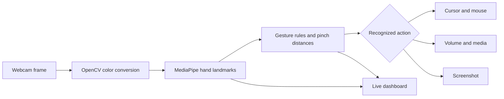

# Gesture Studio

### AI-Based Gesture Controlled Desktop Assistant

Gesture Studio turns a standard webcam into a touch-free desktop controller. It tracks one hand in real time, recognizes practical hand poses, and translates them into cursor, click, media, volume, and screenshot actions.

The project combines OpenCV frame capture, MediaPipe hand landmarks, a lightweight gesture rule set, and operating-system controls. It uses a pretrained hand-landmark model; it does not claim to train a custom AI model.

## What it can do

| Hand pose | Desktop action |
| --- | --- |
| Index finger raised by itself | Move the cursor |
| Thumb and index fingertips pinched | Left click |
| Thumb and middle fingertips pinched | Right click |
| Index and middle fingertips pinched | Double click |
| Thumb and ring fingertips pinched | Drag and drop |
| Thumb and index raised, then separated | Adjust system volume |
| Index and middle fingers raised | Play or pause media |
| Index, middle, and ring fingers raised | Next track |
| Four fingers raised | Previous track |
| Open palm | Save a screenshot |
| Thumbs-up, held briefly | Start or stop an MP4 recording |

The open-palm screenshot captures the desktop. Press **S** to save just the annotated camera preview instead. Hold a **thumbs-up** briefly to start or stop an MP4 recording of the annotated camera preview; recordings are saved locally in `recordings/` and do not include desktop content or audio. The **R** key remains available as a recording shortcut.

The live window shows the current gesture, tracking status, frame rate, cursor-mapping area, and a quick gesture guide. Press **Space** to pause or resume desktop actions while keeping the camera preview open.

## How it works



### Project modules

- `main.py` — camera loop, controls, keyboard shortcuts, and live dashboard.
- `hand_detector.py` — MediaPipe setup and 21 landmark coordinates.
- `gesture_controller.py` — finger states, scale-aware pinch detection, and action cooldowns.
- `mouse_control.py` — smoothed cursor mapping, click, and drag actions.
- `volume_control.py` — macOS volume through AppleScript and Windows volume through Pycaw.
- `media_control.py` — play/pause and track navigation.
- `screenshot.py` — timestamped captures saved under `screenshots/` beside the source.
- `session_recorder.py` — local MP4 recordings of the annotated camera preview.

## Run it on macOS

Python 3.9–3.12 is supported; Python 3.10 or 3.11 is a good choice for a fresh setup. From this folder:

```bash
python3 -m venv .venv
source .venv/bin/activate
python -m pip install --upgrade pip
python -m pip install -r requirements.txt
python main.py
```

If the webcam is not the default camera, select another device:

```bash
python main.py --camera 1
```

macOS may ask for **Camera** access for the app launching Python and **Accessibility** access for cursor and click control. Grant those permissions to Terminal, VS Code, or the app you use to run the project. Volume control uses the built-in `osascript` command.

In VS Code, open this folder and choose **Terminal → Run Task → Run Gesture Studio**. The task uses the project’s `.venv` automatically. If macOS blocks the camera on the first launch, allow camera access for VS Code in **System Settings → Privacy & Security → Camera**, then run the task again.

## Run it on Windows

```powershell
py -3.11 -m venv .venv
.venv\Scripts\Activate.ps1
python -m pip install --upgrade pip
python -m pip install -r requirements.txt
python main.py
```

Pycaw is installed on Windows only. On macOS it is not needed; volume uses AppleScript.

## Controls and presentation tips

- **Esc** or **Q** — exit cleanly.
- **Space** — pause or resume desktop actions.
- **G** — show or hide the gesture quick guide.
- **S** — save the annotated camera preview to `screenshots/`.
- **R** — start/stop an MP4 demo recording in `recordings/`.
- **Thumbs-up, held briefly** — start/stop the MP4 demo recording; lower the thumb between toggles.
- Click the Gesture Studio camera window before using keyboard shortcuts so it receives the keys.
- Use even front lighting and keep the full hand in the outlined camera area.
- Start with cursor movement, then demonstrate a click, a media gesture, volume, and a screenshot.
- Keep **Space** handy so you can pause actions while explaining the project.

For a short talk track, a reliable live-demo sequence, and viva questions, see [PRESENTATION_GUIDE.md](PRESENTATION_GUIDE.md).

## Troubleshooting

| Symptom | What to check |
| --- | --- |
| `ModuleNotFoundError` | Activate `.venv` and install `requirements.txt` in that environment. |
| Camera does not open | Grant camera access, close other video apps, then try `--camera 1`. |
| MediaPipe reports `Could not create an NSOpenGLPixelFormat` | Run from a normal macOS desktop session with an active display; the hand-tracking graph needs a working macOS graphics context. |
| Hand landmarks flicker | Improve lighting, move closer, and keep the palm facing the camera. |
| Cursor feels too sensitive | Increase `smoothing` in `MouseControl` in `mouse_control.py`. |
| Pinches are hard to trigger | Adjust `touch_threshold_ratio` in `GestureController` in `gesture_controller.py`. |
| Cursor and clicks do not work on macOS | Grant Accessibility access to the app running Python, then restart that app. |
| Volume does not change | Check the system output device; on Windows, confirm Pycaw installed successfully. |

## Responsible demo behavior

The hand-tracking preview continues while actions are paused. The camera and desktop controls are released when the app exits. Keep the workspace clear during the demo, since recognized gestures can move the real cursor and trigger real clicks.
